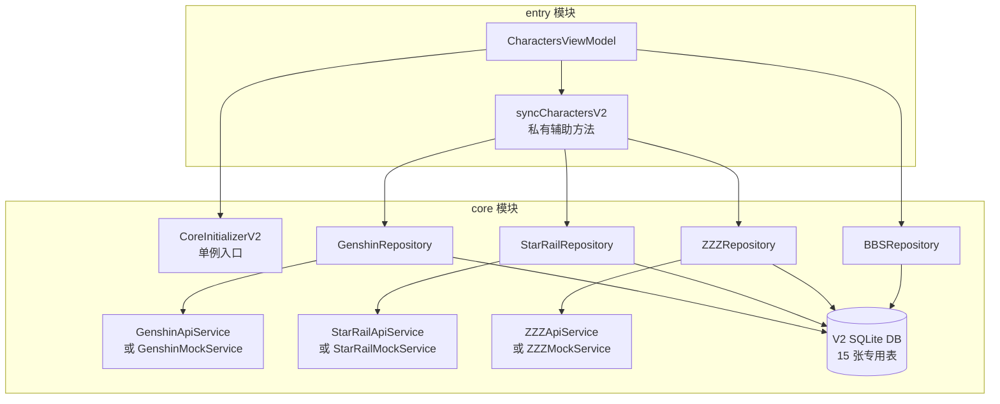
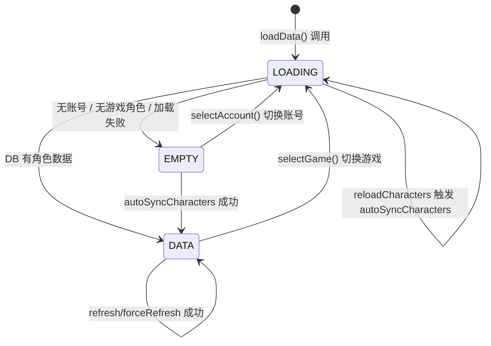
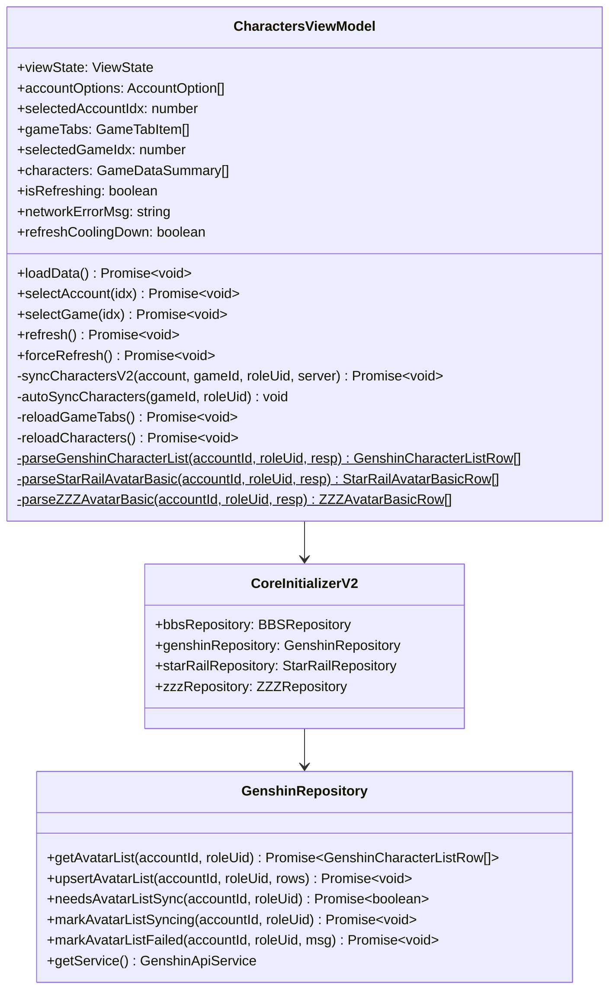

# 设计文档

## 概述

本文档描述 `CharactersViewModel` 从旧版 `CharacterRepository`（V1）迁移到 V2 Repository + V2 ApiService 的技术设计方案。

**修改范围**：仅 `entry/src/main/ets/viewmodel/CharactersViewModel.ets`，Characters 页 View 层和组件层不变。

---

## 架构层次



---

## 数据流图

### 主流程：角色列表同步（V2 架构）

```mermaid
flowchart TD
    A([用户触发刷新 / 角色列表为空]) --> B{触发方式}

    B -- refresh 手动刷新 --> C{isRefreshing?}
    C -- 是 --> Z1([直接返回])
    C -- 否 --> D{gameTabs 为空?}
    D -- 是 --> Z2([直接返回])
    D -- 否 --> E{冷却期内?}
    E -- 是 --> F[refreshCoolingDown 信号翻转\n弹冷却 Dialog]
    E -- 否 --> G[isRefreshing = true]

    B -- forceRefresh 强制刷新 --> C2{isRefreshing?}
    C2 -- 是 --> Z3([直接返回])
    C2 -- 否 --> C3{gameTabs 为空?}
    C3 -- 是 --> Z4([直接返回])
    C3 -- 否 --> G

    B -- autoSyncCharacters 后台静默 --> H[syncCharactersV2]

    G --> H

    H --> I{gameId 分发}
    I -- genshin --> J[genshinRepository.markAvatarListSyncing\ngetService.getCharacterList\n构建 GenshinCharacterListRow[]\ngenshinRepository.upsertAvatarList]
    I -- starrail --> K[starRailRepository.markAvatarListSyncing\ngetService.getAvatarBasic\n构建 StarRailAvatarBasicRow[]\nstarRailRepository.upsertAvatarList]
    I -- zzz --> L[zzzRepository.markAvatarListSyncing\ngetService.getAvatarBasic\n构建 ZZZAvatarBasicRow[]\nzzzRepository.upsertAvatarList]
    I -- 其他 --> M([静默跳过])

    J --> N{同步结果}
    K --> N
    L --> N

    N -- 成功 --> O[reloadCharacters\n从 V2 DB 读取\n更新 UI]
    N -- 失败 --> P[markAvatarListFailed\nnetworkErrorMsg = msg]

    O --> Q[isRefreshing = false]
    P --> Q
```

### 状态机



---

## 需要修改的方法

### 删除的 import

```typescript
// 删除以下行
import { CharacterRepository, ... } from 'core';
// CharacterRepository 从 import 列表中移除
```

### 新增的私有方法：syncCharactersV2

封装单个游戏角色列表的完整 V2 同步流程，供 `refresh`、`forceRefresh`、`autoSyncCharacters` 共用。

**方法签名**

```typescript
private async syncCharactersV2(
  account: AccountRowV2,
  gameId: string,
  roleUid: string,
  server: string
): Promise<void>
```

**实现逻辑**

```typescript
private async syncCharactersV2(
  account: AccountRowV2,
  gameId: string,
  roleUid: string,
  server: string
): Promise<void> {
  if (gameId === GAME_GENSHIN) {
    const repo = CoreInitializerV2.genshinRepository;
    await repo.markAvatarListSyncing(account.id, roleUid);
    const resp = await repo.getService().getCharacterList(roleUid, server, account.cookie);
    // 解析响应，构建 GenshinCharacterListRow[]
    const rows = CharactersViewModel.parseGenshinCharacterList(account.id, roleUid, resp);
    await repo.upsertAvatarList(account.id, roleUid, rows);

  } else if (gameId === GAME_STARRAIL) {
    const repo = CoreInitializerV2.starRailRepository;
    await repo.markAvatarListSyncing(account.id, roleUid);
    const resp = await repo.getService().getAvatarBasic(roleUid, server, account.cookie);
    const rows = CharactersViewModel.parseStarRailAvatarBasic(account.id, roleUid, resp);
    await repo.upsertAvatarList(account.id, roleUid, rows);

  } else if (gameId === GAME_ZZZ) {
    const repo = CoreInitializerV2.zzzRepository;
    await repo.markAvatarListSyncing(account.id, roleUid);
    const resp = await repo.getService().getAvatarBasic(roleUid, server, account.cookie);
    const rows = CharactersViewModel.parseZZZAvatarBasic(account.id, roleUid, resp);
    await repo.upsertAvatarList(account.id, roleUid, rows);
  }
  // 其他 gameId 静默跳过
}
```

---

## 各方法改动详情

### refresh（改动）

**改动前**：调用 `CharacterRepository.syncCharacters(tab.gameId, tab.roleUid, server, account.cookie)`

**改动后**：调用 `this.syncCharactersV2(account, tab.gameId, tab.roleUid, server)`

```typescript
// 改动前（删除）
await CharacterRepository.syncCharacters(
  tab.gameId,
  tab.roleUid,
  server,
  account.cookie,
);

// 改动后（替换）
await this.syncCharactersV2(account, tab.gameId, tab.roleUid, server);
```

**保持不变的部分**：

- 冷却检查逻辑（`needsCharacterSync`）
- `isRefreshing` 防重逻辑
- `reloadCharacters()` 成功后刷新 UI
- `networkErrorMsg` 失败时赋值

---

### forceRefresh（改动）

**改动前**：调用 `CharacterRepository.syncCharacters(tab.gameId, tab.roleUid, ...)`

**改动后**：调用 `this.syncCharactersV2(account, tab.gameId, tab.roleUid, server)`

```typescript
// 改动前（删除）
await CharacterRepository.syncCharacters(
  tab.gameId,
  tab.roleUid,
  this.findServer(tab.roleUid),
  account.cookie,
);

// 改动后（替换）
await this.syncCharactersV2(
  account,
  tab.gameId,
  tab.roleUid,
  this.findServer(tab.roleUid),
);
```

---

### autoSyncCharacters（改动）

**改动前**：调用 `CharacterRepository.syncCharacters(gameId, roleUid, server, account.cookie).then(...)`

**改动后**：调用 `this.syncCharactersV2(account, gameId, roleUid, server)` 并在 `.then()` 中刷新 UI

```typescript
// 改动前（删除）
CharacterRepository.syncCharacters(gameId, roleUid, server, account.cookie)
  .then(async () => { ... })
  .catch(...);

// 改动后（替换）
this.syncCharactersV2(account, gameId, roleUid, server)
  .then(async () => { ... })
  .catch(...);
```

---

## API 响应解析规范

### GenshinApiService.getCharacterList 响应结构

```typescript
// 响应 data 字段结构
{
  list: Array<{
    id: number; // avatarId（数字，需转字符串）
    name: string;
    element: string; // 元素名（如 "Dendro"）
    rarity: number;
    level: number;
    fetter: number; // 好感度
    actived_constellation_num: number;
    icon: string;
    side_icon: string;
    weapon_type: number;
    weapon: {
      name: string;
      level: number;
      affix_level: number;
      rarity: number;
      icon: string;
    };
  }>;
}
```

**构建 GenshinCharacterListRow 规范**

```typescript
const row = new GenshinCharacterListRow();
row.accountId = accountId;
row.roleUid = roleUid;
row.avatarId = `${item.id}`; // 数字转字符串
row.name = item.name;
row.element = item.element;
row.rarity = item.rarity;
row.level = item.level;
row.fetter = item.fetter;
row.activedConstellationNum = item.actived_constellation_num;
row.icon = item.icon;
row.sideIcon = item.side_icon;
row.weaponType = item.weapon_type;
row.weaponName = item.weapon?.name ?? "";
row.weaponLevel = item.weapon?.level ?? 0;
row.weaponAffixLevel = item.weapon?.affix_level ?? 0;
row.weaponRarity = item.weapon?.rarity ?? 0;
row.rawJson = JSON.stringify(item);
row.updateTime = Math.floor(Date.now() / 1000);
```

### StarRailApiService.getAvatarBasic 响应结构

```typescript
// 响应 data 字段结构
{
  list: Array<{
    id: number; // avatarId（数字，需转字符串）
    name: string;
    rarity: number;
    level: number;
    rank: number; // 命座数
    base_type: number; // 命途
    element_id: number; // 属性 ID
    icon: string;
    figure_path: string;
    equip: {
      id: number;
      name: string;
      level: number;
      rank: number;
      rarity: number;
      icon: string;
    } | null;
  }>;
}
```

**构建 StarRailAvatarBasicRow 规范**

```typescript
const row = new StarRailAvatarBasicRow();
row.accountId = accountId;
row.roleUid = roleUid;
row.avatarId = `${item.id}`;
row.name = item.name;
row.rarity = item.rarity;
row.level = item.level;
row.rank = item.rank;
row.baseType = item.base_type;
row.elementId = item.element_id;
row.icon = item.icon;
row.figurePath = item.figure_path;
row.equipId = item.equip ? `${item.equip.id}` : "";
row.equipName = item.equip?.name ?? "";
row.equipLevel = item.equip?.level ?? 0;
row.equipRank = item.equip?.rank ?? 0;
row.equipRarity = item.equip?.rarity ?? 0;
row.rawJson = JSON.stringify(item);
row.updateTime = Math.floor(Date.now() / 1000);
```

### ZZZApiService.getAvatarBasic 响应结构

```typescript
// 响应 data 字段结构
{
  avatar_list: Array<{
    id: number;
    name_mi18n: string;
    full_name_mi18n: string;
    rarity: string; // 'S' 或 'A'
    level: number;
    rank: number;
    element_type: number;
    avatar_profession: number;
    hollow_icon_path: string;
    role_square_url: string;
  }>;
}
```

**构建 ZZZAvatarBasicRow 规范**

```typescript
const row = new ZZZAvatarBasicRow();
row.accountId = accountId;
row.roleUid = roleUid;
row.avatarId = `${item.id}`;
row.nameMi18n = item.name_mi18n;
row.fullNameMi18n = item.full_name_mi18n;
row.rarity = item.rarity;
row.level = item.level;
row.rank = item.rank;
row.elementType = item.element_type;
row.avatarProfession = item.avatar_profession;
row.hollowIconPath = item.hollow_icon_path;
row.roleSquareUrl = item.role_square_url;
row.rawJson = JSON.stringify(item);
row.updateTime = Math.floor(Date.now() / 1000);
```

---

## 组件关系图



---

## 文件改动清单

| 文件                                                   | 改动类型 | 改动内容                                                                                                         |
| ------------------------------------------------------ | -------- | ---------------------------------------------------------------------------------------------------------------- |
| `entry/src/main/ets/viewmodel/CharactersViewModel.ets` | 修改     | 删除 V1 import，新增 `syncCharactersV2` 及三个静态解析方法，改写 `refresh`、`forceRefresh`、`autoSyncCharacters` |
| `entry/src/test/CharactersViewModel.test.ets`          | 新建     | ViewModel 单元测试，覆盖初始状态和纯函数                                                                         |
| `entry/src/test/List.test.ets`                         | 修改     | 注册 `charactersViewModelTest`                                                                                   |

**本 spec 不删除的文件**：

| 文件                                                   | 不删除原因                                              |
| ------------------------------------------------------ | ------------------------------------------------------- |
| `core/src/main/ets/repository/CharacterRepository.ets` | 迁移后在 entry 中无引用，但等所有页面迁移完成后统一清理 |
| `core/Index.ets` 中的 `CharacterRepository` 导出行     | 同上，待所有 entry 页面迁移完成后统一清理               |

---

## 注意事项

### ArkTS 严格模式限制

1. **禁止 `for...of`**：遍历数组使用 `for (let i = 0; i < arr.length; i++)` 形式
2. **禁止 `Array.map/filter`**：使用 `for` 循环替代
3. **禁止 `spread` 展开运算符**：逐字段赋值
4. **`getService()` 向下转型**：`getService()` 返回 `MihoyoApiService` 抽象类，调用具体游戏方法（如 `getCharacterList`、`getAvatarBasic`）时需要向下转型。ArkTS 严格模式允许父类 `as` 子类，但**禁止经过 `unknown` 中间层**（`as unknown as GenshinApiService` 会报 `arkts-no-any-unknown`）。正确写法：`(repo.getService() as GenshinApiService).getCharacterList(...)`
5. **禁止 `object as number/string`**：从 `Record<string, object>` 取出的值类型为 `object`，不能直接 `as number`。应使用本地 interface 声明响应结构，再通过 `resp as InterfaceName` 做类型安全解析（见三个 `parse*` 静态方法的实现）

### 响应数据解析

API 响应的 `data` 字段是 `object` 类型。ArkTS 严格模式下不能直接从 `object` 提取字段，也不能用 `unknown` 中间层。正确方案是在 `CharactersViewModel.ets` 文件顶部声明本地 interface，再通过 `resp as InterfaceName` 做类型安全解析：

```typescript
// 文件顶部声明本地 interface（不导出）
interface GenshinCharacterListData {
  list: GenshinCharacterItem[];
}
interface GenshinCharacterItem {
  id: number;
  name: string;
  // ...
}

// 解析方法中使用
const data = resp as GenshinCharacterListData;
const list = data.list;
```

解析失败时（`try/catch`）返回空数组，不抛异常，不影响其他游戏的同步流程。

### element 字段说明

- 原神：`element` 为英文字符串（如 `"Dendro"`），`GameDataSummary.extraText1` 直接存储
- 星铁：`element_id` 为数字，`GameDataSummary.extraText1` 存储字符串化的数字
- 绝区零：`element_type` 为数字，`GameDataSummary.extraText1` 存储字符串化的数字
