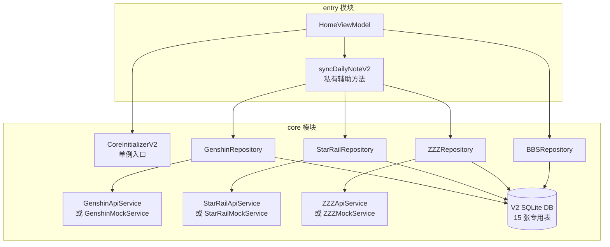
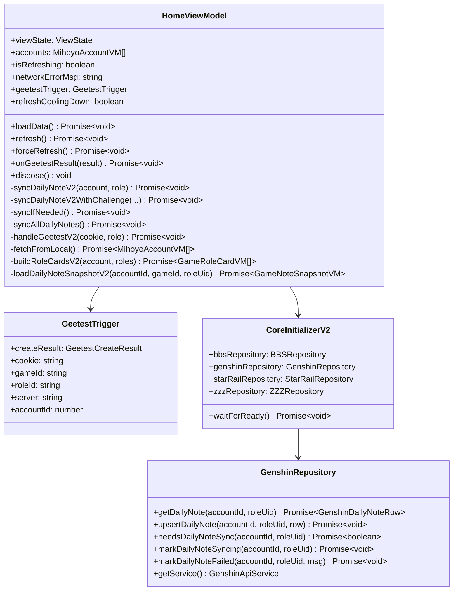

# 设计文档

## 概述

本文档描述 `HomeViewModel` 从旧版 `DailyNoteRepository`（V1）迁移到 V2 Repository + V2 ApiService 的技术设计方案。

**修改范围**：仅 `entry/src/main/ets/viewmodel/HomeViewModel.ets`，其余文件不变。

---

## 架构层次



---

## 需要修改的方法

### 删除的 import

```typescript
// 删除以下两行
import { GameRoleRow, DailyNoteRepository } from "core";
```

### 新增的私有方法：syncDailyNoteV2

这是本次重构的核心新增方法，封装单个角色的完整 V2 同步流程，供 `syncIfNeeded` 和 `syncAllDailyNotes` 共用。

**方法签名**

```typescript
private async syncDailyNoteV2(account: AccountRowV2, role: GameRoleRowV2): Promise<void>
```

**实现逻辑**

```typescript
private async syncDailyNoteV2(account: AccountRowV2, role: GameRoleRowV2): Promise<void> {
  const gameId = role.gameId;

  // 1. 根据 gameId 获取对应 Repository
  if (gameId === GAME_GENSHIN) {
    const repo = CoreInitializerV2.genshinRepository;
    try {
      await repo.markDailyNoteSyncing(account.id, role.roleId);
      const resp = await (repo.getService() as GenshinApiService).getDailyNote(
        role.roleId, role.server, account.cookie
      );
      // 2. 构建 Row 并写库
      const data = resp as Record<string, object>;
      const row = new GenshinDailyNoteRow();
      row.accountId = account.id;
      row.roleUid = role.roleId;
      row.rawJson = JSON.stringify(data);
      // 从 rawJson 解析兜底字段（Parser 负责）
      await repo.upsertDailyNote(account.id, role.roleId, row);
    } catch (error) {
      const msg = error instanceof Error ? error.message : `${error}`;
      if (msg.indexOf(`retcode=${ApiErrorCodes.GEETEST_REQUIRED}`) !== -1) {
        await this.handleGeetestV2(account.cookie, role);
      } else {
        await repo.markDailyNoteFailed(account.id, role.roleId, msg);
        this.networkErrorMsg = msg;
      }
    }
  } else if (gameId === GAME_STARRAIL) {
    // 星铁逻辑，结构与原神相同，使用 StarRailRepository 和 StarRailDailyNoteRow
    // ...
  } else if (gameId === GAME_ZZZ) {
    // 绝区零逻辑，结构与原神相同，使用 ZZZRepository 和 ZZZDailyNoteRow
    // ...
  }
  // 其他 gameId 静默跳过
}
```

---

## 各方法改动详情

### syncIfNeeded（改动）

**改动前**：调用 `DailyNoteRepository.syncDailyNote(gameId, roleId, server, cookie)`

**改动后**：调用 `this.syncDailyNoteV2(account, role)`，仅在 `needsDailyNoteSync` 返回 true 时调用

```typescript
// 改动前（删除）
await DailyNoteRepository.syncDailyNote(
  role.gameId,
  role.roleId,
  role.server,
  account.cookie,
);

// 改动后（替换）
await this.syncDailyNoteV2(account, role);
```

**保持不变的部分**：

- `CoreInitializerV2.bbsRepository.getAllAccounts()` 遍历账号
- `CoreInitializerV2.bbsRepository.getGameRoles(account.id)` 遍历角色
- `HomeViewModel.needsDailyNoteSync(account.id, role.roleId, role.gameId)` 判断是否需要同步
- Geetest 错误检测逻辑（移入 `syncDailyNoteV2` 内部）

---

### syncAllDailyNotes（改动）

**改动前**：调用 `DailyNoteRepository.syncDailyNote(gameId, roleId, server, cookie)`

**改动后**：调用 `this.syncDailyNoteV2(account, role)`，无条件对每个角色调用

```typescript
// 改动前（删除）
await DailyNoteRepository.syncDailyNote(
  role.gameId,
  role.roleId,
  role.server,
  account.cookie,
);

// 改动后（替换）
await this.syncDailyNoteV2(account, role);
```

---

### onGeetestResult（改动）

**改动前**：调用 `DailyNoteRepository.syncDailyNoteWithChallenge(...)`

**改动后**：通过 V2 Repository 的 Service 重新拉取，Service 层负责在请求头注入 challenge

```typescript
// 改动前（删除）
const newChallenge = await GeetestService.verifyVerification(
  result,
  trigger.cookie,
);
await DailyNoteRepository.syncDailyNoteWithChallenge(
  trigger.gameId,
  trigger.roleId,
  trigger.server,
  trigger.cookie,
  newChallenge,
  result.geetest_validate,
  result.geetest_seccode,
);

// 改动后（替换）
const newChallenge = await GeetestService.verifyVerification(
  result,
  trigger.cookie,
);
// 通过 V2 Service 重新拉取，challenge 由 Service 层注入请求头
// 注意：需要在 trigger 中保存 accountId，以便写库时使用
await this.syncDailyNoteV2WithChallenge(
  trigger.accountId,
  trigger.cookie,
  trigger.gameId,
  trigger.roleId,
  trigger.server,
  newChallenge,
  result.geetest_validate,
  result.geetest_seccode,
);
const loaded = await this.fetchFromLocal();
this.accounts = loaded;
this.viewState = loaded.length > 0 ? ViewState.DATA : ViewState.EMPTY;
```

> **注意**：`GeetestTrigger` 需要新增 `accountId: number` 字段，以便 `onGeetestResult` 写库时能传入正确的 accountId。

---

## 数据模型变更

### GeetestTrigger 新增字段

```typescript
// 改动前
export class GeetestTrigger {
  createResult: GeetestCreateResult;
  cookie: string;
  gameId: string;
  roleId: string;
  server: string;
}

// 改动后（新增 accountId）
export class GeetestTrigger {
  createResult: GeetestCreateResult;
  cookie: string;
  gameId: string;
  roleId: string;
  server: string;
  accountId: number; // 新增：写库时需要
}
```

### V2 Row 构建规范

各游戏 Row 的构建方式如下：

**GenshinDailyNoteRow**

```typescript
const row = new GenshinDailyNoteRow();
row.accountId = account.id;
row.roleUid = role.roleId;
row.rawJson = JSON.stringify(responseData); // API 响应的 data 字段
row.updateTime = Math.floor(Date.now() / 1000);
// 其余字段（currentResin 等）由 GenshinDailyNoteParser 从 rawJson 解析，
// fetchFromLocal 时通过 Parser 读取，不需要在 Row 中单独赋值
```

**StarRailDailyNoteRow**

```typescript
const row = new StarRailDailyNoteRow();
row.accountId = account.id;
row.roleUid = role.roleId;
row.rawJson = JSON.stringify(responseData);
row.updateTime = Math.floor(Date.now() / 1000);
// 兜底字段：Parser 解析失败时 fetchFromLocal 直接读 Row 字段
const parsed = StarRailDailyNoteParser.parse(row.rawJson);
row.currentStamina = parsed.currentStamina;
row.maxStamina = parsed.maxStamina;
```

**ZZZDailyNoteRow**

```typescript
const row = new ZZZDailyNoteRow();
row.accountId = account.id;
row.roleUid = role.roleId;
row.rawJson = JSON.stringify(responseData);
row.updateTime = Math.floor(Date.now() / 1000);
// 兜底字段
const parsed = ZZZDailyNoteParser.parse(row.rawJson);
row.energyCurrent = parsed.currentEnergy;
row.energyMax = parsed.maxEnergy;
```

---

## V2 ApiService 接口说明

### GenshinApiService.getDailyNote

```typescript
// 签名
async getDailyNote(roleId: string, server: string, cookie: string): Promise<object>

// 返回值结构（API 响应的 data 字段）
{
  current_resin: number,
  max_resin: number,
  resin_recovery_time: string,  // 秒数字符串
  finished_task_num: number,
  total_task_num: number,
  is_extra_task_reward_received: boolean,
  remain_resin_discount_num: number,
  resin_discount_num_limit: number,
  current_expedition_num: number,
  max_expedition_num: number,
  expeditions: Array<{ status: string, remained_time: string, ... }>,
  current_home_coin: number,
  max_home_coin: number,
  home_coin_recovery_time: string,
  transformer: { obtained: boolean, recovery_time: { Day: number, Hour: number, Minute: number, ... } }
}
```

### StarRailApiService.getDailyNote

```typescript
// 签名（与 GenshinApiService 相同）
async getDailyNote(roleId: string, server: string, cookie: string): Promise<object>

// 返回值结构（API 响应的 data 字段）
{
  current_stamina: number,
  max_stamina: number,
  stamina_recover_time: number,
  current_reserve_stamina: number,
  is_reserve_stamina_full: boolean,
  current_train_score: number,
  max_train_score: number,
  weekly_cocoon_cnt: number,
  weekly_cocoon_limit: number,
  rogue_tourn_weekly_cur: number,
  rogue_tourn_weekly_max: number,
  grid_fight_weekly_cur: number,
  grid_fight_weekly_max: number,
  ...
}
```

### ZZZApiService.getDailyNote

```typescript
// 签名（与 GenshinApiService 相同）
async getDailyNote(roleId: string, server: string, cookie: string): Promise<object>

// 返回值结构（API 响应的 data 字段）
{
  energy: { progress: { current: number, max: number }, restore: number },
  vitality: { current: number, max: number },
  card_sign: string,  // 'CardSignDone' | 'CardSignNo'
  vhs_sale: { sale_state: string },  // 'SaleStateDone' | 'SaleStateDoing' | 'SaleStateNo'
  ...
}
```

---

## 组件关系图



---

## 文件改动清单

| 文件                                             | 改动类型 | 改动内容                                                                                            |
| ------------------------------------------------ | -------- | --------------------------------------------------------------------------------------------------- |
| `entry/src/main/ets/viewmodel/HomeViewModel.ets` | 修改     | 删除 V1 import，新增 `syncDailyNoteV2`，改写 `syncIfNeeded`、`syncAllDailyNotes`、`onGeetestResult` |
| `entry/src/main/ets/viewmodel/HomeViewModel.ets` | 修改     | `GeetestTrigger` 新增 `accountId` 字段                                                              |

**本 spec 不删除的文件（原因说明）**：

| 文件                                                                            | 不删除原因                                                                                                                                                                           |
| ------------------------------------------------------------------------------- | ------------------------------------------------------------------------------------------------------------------------------------------------------------------------------------ |
| `core/src/main/ets/repository/DailyNoteRepository.ets`                          | `HomeViewModel` 迁移后此文件在 entry 中无引用，但 `CharacterRepository.ets` 仍被 `CharactersViewModel` 引用，V1 旧版 Repository 层尚未完全清理，待 Characters 页 spec 完成后统一删除 |
| `core/src/main/ets/repository/CharacterRepository.ets`                          | 仍被 `CharactersViewModel` 引用，属于 Characters 页 spec 的清理范围                                                                                                                  |
| `core/Index.ets` 中的 V1 导出行（`DailyNoteRepository`、`CharacterRepository`） | 同上，待所有 entry 页面迁移完成后统一清理                                                                                                                                            |

**不修改的文件**：

- `entry/src/main/ets/pages/Home.ets`
- `entry/src/main/ets/components/home/HomeModels.ets`
- `entry/src/main/ets/components/home/GameToolCard.ets`
- `entry/src/main/ets/components/home/UserGameSection.ets`
- `core/` 目录下所有文件（本 spec 范围内）

---

## 注意事项

### ArkTS 严格模式限制

1. **禁止 `!` 非空断言**：`getService()` 已在 `GameRepository` 基类中做了 null 检查，抛出 Error，调用方无需额外处理
2. **禁止 `as` 类型断言到具体 Service 类型**：`getService()` 返回 `MihoyoApiService` 抽象类，`getDailyNote` 是各游戏 Service 的具体方法，需要通过 `CoreInitializerV2.genshinRepository.getService()` 获取后直接调用，不需要类型断言（因为 `GenshinRepository.getService()` 返回的就是 `GenshinApiService`）
3. **禁止 `for...of`**：遍历数组使用 `for (let i = 0; i < arr.length; i++)` 形式

### Geetest 重试时的 accountId 来源

`onGeetestResult` 被调用时，`geetestTrigger` 中需要携带 `accountId`，以便调用 `upsertDailyNote(accountId, roleId, row)` 时传入正确的值。`handleGeetestV2` 方法签名需要同步更新，接收 `account: AccountRowV2` 而非仅 `cookie: string`。

### rawJson 序列化

API 响应的 `data` 字段是 `object` 类型，需要通过 `JSON.stringify(data)` 序列化后存入 `rawJson`。`fetchFromLocal` 时通过对应 Parser（`GenshinDailyNoteParser.parse`、`StarRailDailyNoteParser.parse`、`ZZZDailyNoteParser.parse`）从 `rawJson` 反序列化，这部分逻辑已存在，不需要改动。
