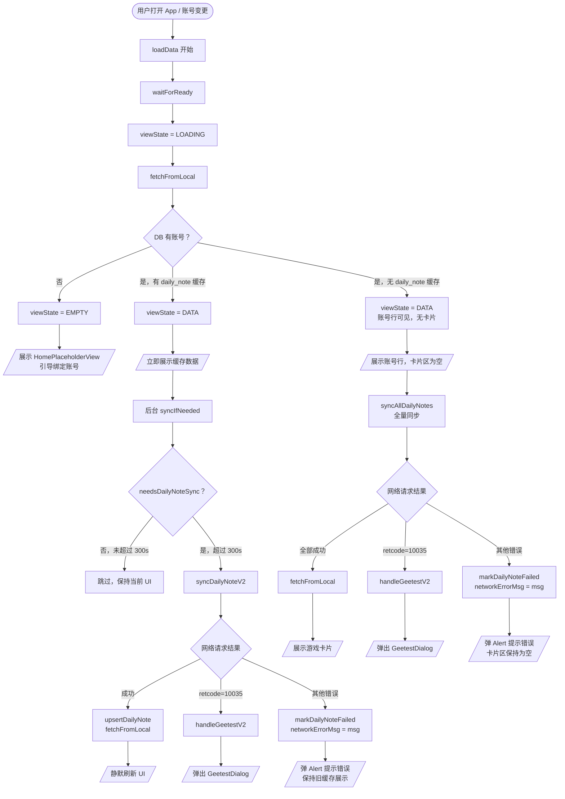
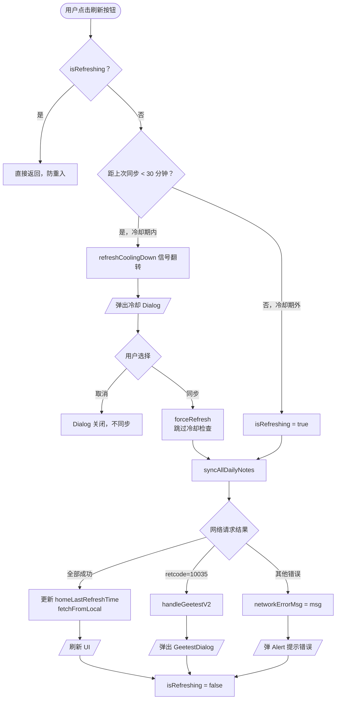
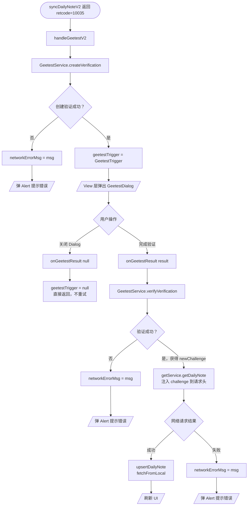
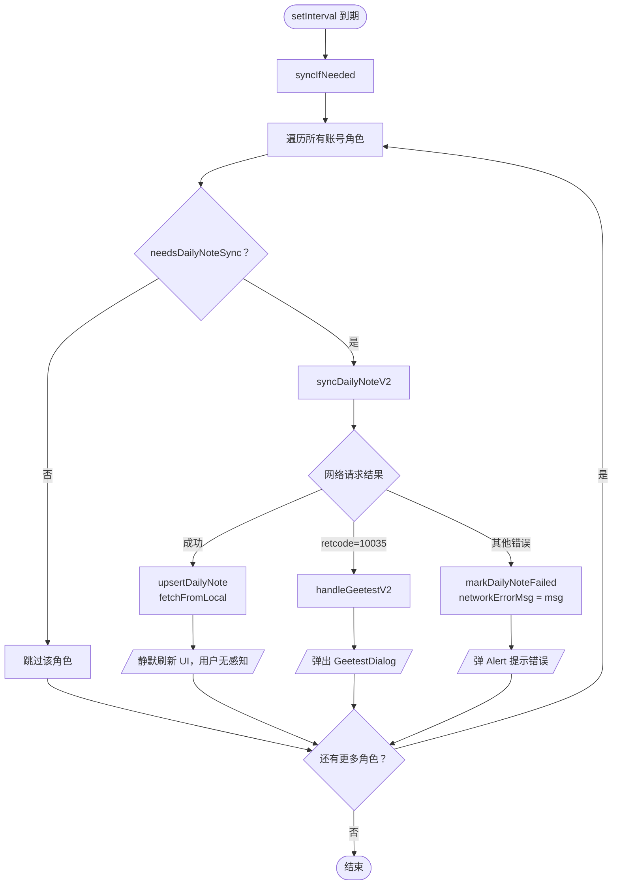
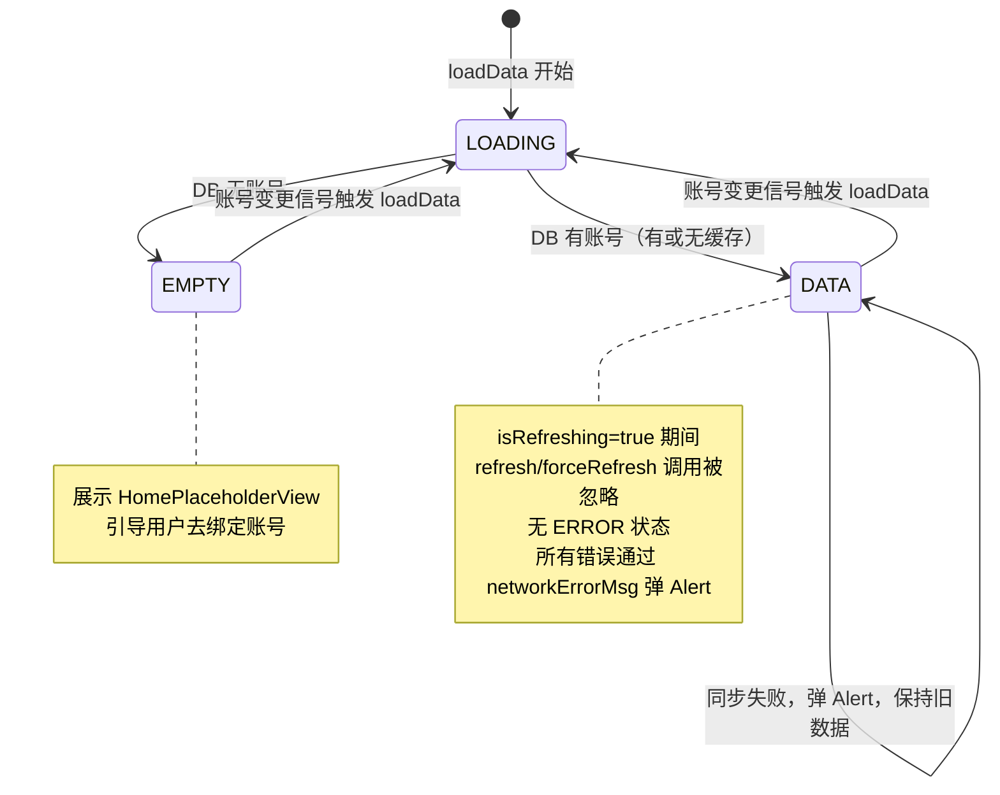

# 需求文档

## 简介

本 spec 覆盖 `HomeViewModel` 从旧版 `DailyNoteRepository`（V1）迁移到 V2 Repository + V2 ApiService 的完整重构工作。

**范围**：仅修改 `entry/src/main/ets/viewmodel/HomeViewModel.ets`，Home 页 View 层（`Home.ets`）、数据模型（`HomeModels.ets`）、卡片组件（`GameToolCard.ets`、`UserGameSection.ets`）均已完成，**不在本 spec 修改范围内**。

**目标**：

1. 移除所有旧版 `DailyNoteRepository` 调用，切换到 V2 Repository 的 `getDailyNote` + `upsertDailyNote`
2. 移除旧版 `GameRoleRow`（V1 模型）import
3. Geetest 回调中改用 V2 Service 的 `getDailyNote` 重新拉取并写库
4. 保持 Home 页 UI 功能和用户体验完全不变
5. 每次 spec 执行完成后 clean + rebuild 验证，警告需记录

---

## 术语表

- **HomeViewModel**：首页 ViewModel，持有 `accounts`、`viewState`、`isRefreshing` 等 UI 状态，负责调度同步和读取本地 DB
- **V2 Repository**：`GenshinRepository`、`StarRailRepository`、`ZZZRepository`，通过 `CoreInitializerV2` 单例访问，提供 `getDailyNote`、`upsertDailyNote`、`markDailyNoteSyncing`、`markDailyNoteFailed`、`needsDailyNoteSync` 等方法
- **V2 ApiService**：`GenshinApiService`、`StarRailApiService`、`ZZZApiService`，通过对应 Repository 的 `getService()` 获取，提供 `getDailyNote(roleId, server, cookie)` 网络方法
- **DailyNoteRepository**：旧版（V1）网络同步工具类，本 spec 完成后将从 HomeViewModel 中完全移除
- **GameRoleRow**：旧版（V1）游戏角色数据模型，本 spec 完成后将从 HomeViewModel 中完全移除
- **GameRoleRowV2**：V2 游戏角色数据模型，已在 HomeViewModel 中使用
- **GeetestTrigger**：Geetest 人机验证触发信号，携带 `createResult`、`cookie`、`gameId`、`roleId`、`server`
- **syncIfNeeded**：按需同步方法，遍历所有角色，只对 `needsDailyNoteSync` 返回 true 的角色触发网络请求
- **syncAllDailyNotes**：全量同步方法，遍历所有角色无条件触发网络请求
- **onGeetestResult**：Geetest 验证完成回调，携带验证结果后重新拉取便笺
- **SYNC_INTERVAL_SECONDS**：同步间隔阈值，300 秒（5 分钟），由 `GameRepository` 基类定义
- **AUTO_REFRESH_INTERVAL_MS**：自动刷新定时器间隔，由 `AppConstants` 定义（毫秒）
- **ApiErrorCodes.GEETEST_REQUIRED**：retcode=10035，触发 Geetest 人机验证的错误码

---

## 需求列表

### 需求 1：移除旧版 import，切换到 V2 依赖

**用户故事：** 作为开发者，我希望移除 HomeViewModel 中所有 V1 旧版 import，使代码库不再依赖已废弃的 DailyNoteRepository 和 GameRoleRow。

#### 验收标准

1. `HomeViewModel` 不得 import `DailyNoteRepository`
2. `HomeViewModel` 不得 import `GameRoleRow`（V1 模型）
3. `HomeViewModel` 保留已有的 `GenshinDailyNoteParser`、`StarRailDailyNoteParser`、`ZZZDailyNoteParser` import（不变）
4. `HomeViewModel` 保留已有的 `CoreInitializerV2`、`AccountRowV2`、`GameRoleRowV2`、`GeetestService`、`GeetestCreateResult`、`GeetestVerifyInput`、`ApiErrorCodes` import（不变）
5. 移除 V1 import 后，编译器不得产生任何与 import 相关的错误

---

### 需求 2：syncIfNeeded 切换到 V2 网络调用

**用户故事：** 作为开发者，我希望 syncIfNeeded 使用 V2 Repository 和 V2 ApiService 进行网络同步，使便笺数据通过新架构拉取和持久化。

#### 验收标准

1. `syncIfNeeded` 被调用时，`HomeViewModel` 通过 `CoreInitializerV2.bbsRepository.getAllAccounts()` 遍历所有账号
2. 遍历角色时，`HomeViewModel` 调用对应 V2 Repository 的 `needsDailyNoteSync(accountId, roleId)` 判断是否需要同步
3. 需要同步时，`HomeViewModel` 在发起网络请求前调用对应 V2 Repository 的 `markDailyNoteSyncing(accountId, roleId)`
4. 需要同步时，`HomeViewModel` 调用对应 V2 Repository 的 `getService().getDailyNote(roleId, server, cookie)` 从网络拉取数据
5. 收到网络响应后，`HomeViewModel` 解析原始 JSON 并调用对应 V2 Repository 的 `upsertDailyNote(accountId, roleId, row)` 持久化数据
6. 若网络调用抛出 `retcode=10035` 错误，`HomeViewModel` 调用 `handleGeetestV2` 触发 Geetest 流程
7. 若网络调用抛出其他错误，`HomeViewModel` 调用 `markDailyNoteFailed(accountId, roleId, errorMsg)` 并将 `networkErrorMsg` 设为错误信息
8. `HomeViewModel` 根据 `role.gameId` 分发到正确的 V2 Repository：`GAME_GENSHIN` → `genshinRepository`，`GAME_STARRAIL` → `starRailRepository`，`GAME_ZZZ` → `zzzRepository`
9. 若 `role.gameId` 不属于三款支持的游戏，`HomeViewModel` 跳过该角色的同步，不报错

---

### 需求 3：syncAllDailyNotes 切换到 V2 网络调用

**用户故事：** 作为开发者，我希望 syncAllDailyNotes 使用 V2 Repository 和 V2 ApiService，使强制全量刷新也通过新架构执行。

#### 验收标准

1. `syncAllDailyNotes` 被调用时，`HomeViewModel` 遍历所有账号和角色，不检查 `needsDailyNoteSync`
2. 遍历角色时，`HomeViewModel` 在发起网络请求前调用 `markDailyNoteSyncing(accountId, roleId)`
3. 收到网络响应后，`HomeViewModel` 解析原始 JSON 并调用 `upsertDailyNote(accountId, roleId, row)` 持久化数据
4. 若网络调用抛出 `retcode=10035` 错误，`HomeViewModel` 调用 `handleGeetestV2` 触发 Geetest 流程
5. 若网络调用抛出其他错误，`HomeViewModel` 调用 `markDailyNoteFailed(accountId, roleId, errorMsg)` 并将 `networkErrorMsg` 设为错误信息
6. `HomeViewModel` 根据 `role.gameId` 分发到正确的 V2 Repository

---

### 需求 4：onGeetestResult 切换到 V2 网络调用

**用户故事：** 作为开发者，我希望 onGeetestResult 使用带 challenge 参数的 V2 ApiService，使 Geetest 验证结果通过新架构处理。

#### 验收标准

1. `onGeetestResult` 收到非 null 结果时，`HomeViewModel` 调用 `GeetestService.verifyVerification(result, trigger.cookie)` 获取新的 challenge
2. 获取 challenge 后，`HomeViewModel` 调用对应 V2 Repository 的 `getService().getDailyNote(roleId, server, cookie)`，由 Service 层在请求头注入 challenge / validate / seccode
3. 收到网络响应后，`HomeViewModel` 解析原始 JSON 并调用 `upsertDailyNote(accountId, roleId, row)` 持久化数据
4. 数据持久化后，`HomeViewModel` 调用 `fetchFromLocal()` 并更新 `accounts` 和 `viewState`
5. `onGeetestResult` 收到 null 结果时，`HomeViewModel` 立即返回，不发起任何网络请求
6. `onGeetestResult` 在 `geetestTrigger` 为 null 时被调用，`HomeViewModel` 立即返回，不报错
7. Geetest 重试流程中任意步骤抛出错误，`HomeViewModel` 将 `networkErrorMsg` 设为错误信息

---

### 需求 5：V2 同步辅助方法封装

**用户故事：** 作为开发者，我希望有一个私有辅助方法封装单个角色的 V2 同步逻辑，使 syncIfNeeded 和 syncAllDailyNotes 共用同一实现，避免代码重复。

#### 验收标准

1. `HomeViewModel` 提供私有方法 `syncDailyNoteV2(account: AccountRowV2, role: GameRoleRowV2)`，封装单个角色的完整 V2 同步流程
2. `syncDailyNoteV2` 被调用时，依次执行：`markDailyNoteSyncing` → `getService().getDailyNote` → 解析响应 → `upsertDailyNote`
3. `syncDailyNoteV2` 遇到 Geetest 错误时，调用 `handleGeetestV2`
4. `syncDailyNoteV2` 遇到其他错误时，调用 `markDailyNoteFailed` 并设置 `networkErrorMsg`
5. `syncIfNeeded` 仅在 `needsDailyNoteSync` 返回 true 时调用 `syncDailyNoteV2`
6. `syncAllDailyNotes` 对每个角色无条件调用 `syncDailyNoteV2`

---

### 需求 6：V2 Row 构建规范

**用户故事：** 作为开发者，我希望 V2 Row 对象从 API 响应中正确构建，使存入数据库的数据准确完整。

#### 验收标准

1. 构建 `GenshinDailyNoteRow` 时，`HomeViewModel` 将响应数据对象序列化为 JSON 字符串并赋值给 `rawJson`
2. 构建 `StarRailDailyNoteRow` 时，`HomeViewModel` 将响应数据对象序列化为 JSON 字符串赋值给 `rawJson`，同时将 Parser 解析值赋给 `currentStamina` 和 `maxStamina` 作为兜底字段
3. 构建 `ZZZDailyNoteRow` 时，`HomeViewModel` 将响应数据对象序列化为 JSON 字符串赋值给 `rawJson`，同时将 Parser 解析值赋给 `energyCurrent` 和 `energyMax` 作为兜底字段
4. 调用 `upsertDailyNote` 前，`HomeViewModel` 在每个 Row 上设置 `accountId` 和 `roleUid`
5. 若 API 响应无法序列化为 JSON，`HomeViewModel` 将其视为同步失败并调用 `markDailyNoteFailed`

---

### 需求 7：UI 功能和用户体验不变

**用户故事：** 作为用户，我希望 V2 迁移后 Home 页的外观和行为与迁移前完全一致，使重构对我透明无感。

#### 验收标准

1. `HomeViewModel` 保留所有现有公开属性：`viewState`、`accounts`、`isRefreshing`、`networkErrorMsg`、`geetestTrigger`、`refreshCoolingDown`
2. `HomeViewModel` 保留所有现有公开方法：`loadData()`、`refresh()`、`forceRefresh()`、`onGeetestResult()`、`dispose()`
3. `loadData()` 被调用时，`HomeViewModel` 遵循相同的状态机：LOADING → DATA（有数据）或 LOADING → EMPTY（无数据）
4. `refresh()` 在冷却期内被调用时，`HomeViewModel` 切换 `refreshCoolingDown` 以触发冷却 Dialog
5. `dispose()` 被调用时，`HomeViewModel` 停止自动刷新定时器
6. `HomeViewModel` 保持通过 `setInterval` 实现的 30 分钟自动刷新定时器行为
7. `fetchFromLocal()` 方法保持不变，继续从 V2 DB 读取数据并构建 `MihoyoAccountVM[]`

---

### 需求 8：构建验证要求

**用户故事：** 作为开发者，我希望迁移完成后项目能成功构建，以确认没有引入回归问题。

#### 验收标准

1. 迁移完成后，执行 `hvigorw clean && hvigorw assembleHap -p product=mock` 输出 `BUILD SUCCESSFUL`，零编译错误
2. 构建产物不得产生超出"已知警告说明"中预存在警告的新警告
3. 若出现新警告，开发者须排查并修复，或记录在"已知警告说明"的新增警告区
4. 构建产物须能成功安装并在 Mate 80 Pro Max 模拟器（`127.0.0.1:5555`）上启动

---

## 数据流文档

### 主流程：loadData()



---

### 子流程：手动刷新



---

### 子流程：Geetest 验证



---

### 子流程：30 分钟自动刷新



---

### 状态机



---

### V2 Row 构建规范

| 游戏   | Row 类型               | rawJson 来源                      | 额外字段                                        |
| ------ | ---------------------- | --------------------------------- | ----------------------------------------------- |
| 原神   | `GenshinDailyNoteRow`  | `JSON.stringify(responseDataObj)` | 无额外字段                                      |
| 星铁   | `StarRailDailyNoteRow` | `JSON.stringify(responseDataObj)` | `currentStamina`、`maxStamina`（Parser 解析值） |
| 绝区零 | `ZZZDailyNoteRow`      | `JSON.stringify(responseDataObj)` | `energyCurrent`、`energyMax`（Parser 解析值）   |

---

## 测试用例设计

### ViewModel 单元测试（entry/src/test/HomeViewModel.test.ets）

> 遵循 testing-entry-pages.md 规范，只测试纯逻辑，不依赖设备，不 import core Repository 或 DAO。

| 测试用例                                      | 前置条件                 | 操作                                  | 预期结果                                   |
| --------------------------------------------- | ------------------------ | ------------------------------------- | ------------------------------------------ |
| 初始 viewState 为 LOADING                     | 新建实例                 | `new HomeViewModel()`                 | `viewState === ViewState.LOADING`          |
| 初始 accounts 为空数组                        | 新建实例                 | `new HomeViewModel()`                 | `accounts.length === 0`                    |
| 初始 isRefreshing 为 false                    | 新建实例                 | `new HomeViewModel()`                 | `isRefreshing === false`                   |
| 初始 networkErrorMsg 为空                     | 新建实例                 | `new HomeViewModel()`                 | `networkErrorMsg === ''`                   |
| 初始 geetestTrigger 为 null                   | 新建实例                 | `new HomeViewModel()`                 | `geetestTrigger === null`                  |
| 初始 refreshCoolingDown 为 false              | 新建实例                 | `new HomeViewModel()`                 | `refreshCoolingDown === false`             |
| refresh 时 isRefreshing 已为 true 则跳过      | `isRefreshing=true`      | `vm.refresh()`                        | 不重复触发，isRefreshing 保持 true         |
| forceRefresh 时 isRefreshing 已为 true 则跳过 | `isRefreshing=true`      | `vm.forceRefresh()`                   | 不重复触发，isRefreshing 保持 true         |
| onGeetestResult 传入 null 时直接返回          | `geetestTrigger` 非 null | `vm.onGeetestResult(null)`            | geetestTrigger 置为 null，不触发网络请求   |
| onGeetestResult 在 geetestTrigger=null 时调用 | `geetestTrigger=null`    | `vm.onGeetestResult(mockResult)`      | 不崩溃，直接返回                           |
| dispose 后定时器停止                          | 已启动定时器             | `vm.dispose()`                        | 不再触发自动刷新                           |
| 多次调用 dispose 不崩溃                       | 已 dispose               | 再次调用 `vm.dispose()`               | 不崩溃                                     |
| resinRecoveryDesc 秒数转换 — 超过 1 小时      | 输入 `3660` 秒           | `resinRecoveryDesc(3660)`             | 包含 '1 小时'                              |
| resinRecoveryDesc 秒数转换 — 不足 1 小时      | 输入 `600` 秒            | `resinRecoveryDesc(600)`              | 包含 '10 分钟'                             |
| resinRecoveryDesc 秒数为 0                    | 输入 `0`                 | `resinRecoveryDesc(0)`                | 返回 `''`                                  |
| resinRecoveryDesc 秒数为负数                  | 输入 `-1`                | `resinRecoveryDesc(-1)`               | 返回 `''`                                  |
| gameColor 原神返回正确颜色资源                | —                        | `HomeViewModel.gameColor('genshin')`  | 返回 `$r('app.color.game_color_genshin')`  |
| gameColor 星铁返回正确颜色资源                | —                        | `HomeViewModel.gameColor('starrail')` | 返回 `$r('app.color.game_color_starrail')` |
| gameColor 绝区零返回正确颜色资源              | —                        | `HomeViewModel.gameColor('zzz')`      | 返回 `$r('app.color.game_color_zzz')`      |
| gameColor 未知 gameId 返回 accent 颜色        | —                        | `HomeViewModel.gameColor('unknown')`  | 返回 `$r('app.color.color_accent')`        |

### 边界场景补充

| 测试用例                                   | 操作                                                | 预期结果                                   |
| ------------------------------------------ | --------------------------------------------------- | ------------------------------------------ |
| refreshCoolingDown 切换触发 View 弹 Dialog | `refreshCoolingDown=false`，调用 refresh 且在冷却期 | `refreshCoolingDown` 变为 true（信号翻转） |
| KEYS 常量路径与字段名一致                  | 检查 `HomeViewModel.KEYS.networkErrorMsg`           | 值为 `'vm.networkErrorMsg'`                |
| KEYS 常量路径 geetestTrigger 正确          | 检查 `HomeViewModel.KEYS.geetestTrigger`            | 值为 `'vm.geetestTrigger'`                 |
| KEYS 常量路径 refreshCoolingDown 正确      | 检查 `HomeViewModel.KEYS.refreshCoolingDown`        | 值为 `'vm.refreshCoolingDown'`             |

---

## 构建验证要求

### 执行步骤

每次 spec 任务执行完成后，必须按以下顺序验证：

```bash
# 1. 清理
"$HVIGOR" clean

# 2. 构建（mock 模式）
"$HVIGOR" assembleHap -p product=mock

# 3. 安装
"$HDC" -t 127.0.0.1:5555 install entry/build/mock/outputs/mock/entry-mock-unsigned.hap

# 4. 启动
"$HDC" -t 127.0.0.1:5555 shell aa start -b com.cainluo.mihoyo.tools -a EntryAbility
```

### 验收标准

1. `hvigorw assembleHap -p product=mock` 输出 `BUILD SUCCESSFUL`，零编译错误
2. 安装和启动无异常
3. 新增警告必须记录在下方"已知警告说明"中

---

## 已知警告说明

### 预存在警告（迁移前已存在，不属于本 spec 引入）

| 警告来源                      | 警告内容                                                                                      | 说明                                                                                    |
| ----------------------------- | --------------------------------------------------------------------------------------------- | --------------------------------------------------------------------------------------- |
| `RdbManagerV2.ets`            | `canIUse('SystemCapability.DistributedDataManager.RelationalStore.Core')` 返回 false 相关警告 | HarmonyOS NEXT 模拟器环境下 RDB canIUse 检查的已知问题，不影响功能，运行时 RDB 正常工作 |
| `GenshinApiService.ets`       | `x-rpc-tool_verison` 拼写警告（米游社服务端拼写错误 `verison`，非 `version`）                 | 故意保留，与服务端保持一致，修改会导致接口鉴权失败                                      |
| `HomeViewModel.ets`（迁移前） | `DailyNoteRepository` 相关的 deprecated 或 unused import 警告                                 | 本 spec 完成后此警告应消失；若迁移后仍存在，视为需修复的 bug                            |

### 迁移后新增警告记录区

> 执行 clean + rebuild 后，若出现新警告，在此处记录：

| 警告来源   | 警告内容   | 处理方式   |
| ---------- | ---------- | ---------- |
| （待填写） | （待填写） | （待填写） |
