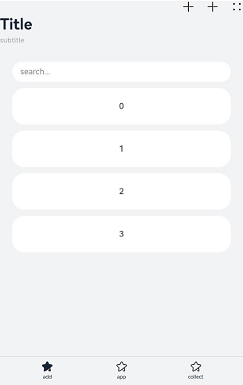

# Navigation 示例代码

- 说明：这是单屏 Navigation 的示例代码
- 地址链接：https://developer.huawei.com/consumer/cn/doc/harmonyos-references/ts-basic-components-navigation#%E7%A4%BA%E4%BE%8B1navigation%E9%A1%B5%E9%9D%A2%E5%B8%83%E5%B1%80

- 示例图：



```TypeScript
// xxx.ets

@Entry
@Component
struct NavigationExample {
  private arr: number[] = [0, 1, 2, 3, 4, 5, 6, 7, 8, 9];

  @Builder
  NavigationTitle() {
    Column() {
      Text('Title')
        .fontColor('#182431')
        .fontSize(30)
        .lineHeight(41)
        .fontWeight(700)
      Text('subtitle')
        .fontColor('#182431')
        .fontSize(14)
        .lineHeight(19)
        .opacity(0.4)
        .margin({ top: 2, bottom: 20 })
    }.alignItems(HorizontalAlign.Start)
  }

  @Builder
  NavigationMenus() {
    Row() {
      // 'resources/base/media/ic_public_add.svg'需要替换为开发者所需的资源文件
      Image('resources/base/media/ic_public_add.svg')
        .width(24)
        .height(24)
      // 'resources/base/media/ic_public_add.svg'需要替换为开发者所需的资源文件
      Image('resources/base/media/ic_public_add.svg')
        .width(24)
        .height(24)
        .margin({ left: 24 })
      // 'resources/base/media/ic_public_more.svg'需要替换为开发者所需的资源文件
      Image('resources/base/media/ic_public_more.svg')
        .width(24)
        .height(24)
        .margin({ left: 24 })
    }
  }

  build() {
    Column() {
      Navigation() {
        TextInput({ placeholder: 'search...' })
          .width('90%')
          .height(40)
          .backgroundColor('#FFFFFF')
          .margin({ top: 8 })

        List({ space: 12, initialIndex: 0 }) {
          ForEach(this.arr, (item: number) => {
            ListItem() {
              Text('' + item)
                .width('90%')
                .height(72)
                .backgroundColor('#FFFFFF')
                .borderRadius(24)
                .fontSize(16)
                .fontWeight(500)
                .textAlign(TextAlign.Center)
            }
          }, (item: number) => item.toString())
        }
        .height(324)
        .width('100%')
        .margin({ top: 12, left: '10%' })
      }
      .title(this.NavigationTitle)
      .menus(this.NavigationMenus)
      .titleMode(NavigationTitleMode.Full)
      .toolbarConfiguration([
        {
          // $r("app.string.navigation_toolbar_add")和$r("app.media.ic_public_highlights_ed")需要替换为开发者所需的资源文件
          value: $r("app.string.navigation_toolbar_add"),
          icon: $r("app.media.ic_public_highlights_ed")
        },
        {
          // $r("app.string.navigation_toolbar_app")和$r("app.media.ic_public_highlights")需要替换为开发者所需的资源文件
          value: $r("app.string.navigation_toolbar_app"),
          icon: $r("app.media.ic_public_highlights")
        },
        {
          // $r("app.string.navigation_toolbar_collect")和$r("app.media.ic_public_highlights")需要替换为开发者所需的资源文件
          value: $r("app.string.navigation_toolbar_collect"),
          icon: $r("app.media.ic_public_highlights")
        }
      ])
      .hideTitleBar(false)
      .hideToolBar(false)
      .onTitleModeChange((titleModel: NavigationTitleMode) => {
        console.info('titleMode' + titleModel)
      })
    }.width('100%').height('100%').backgroundColor('#F1F3F5')
  }
}
```
