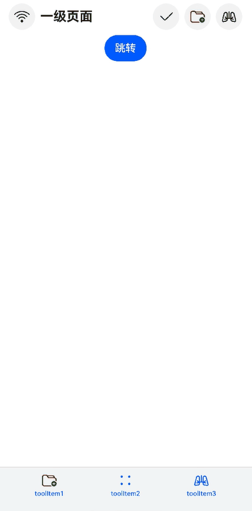

# Navigation11

- 示例11（使用Symbol组件）
- 该示例主要演示Navigation和NavDestination如何使用Symbol组件。
- 示例截图



```TypeScript
// Index.ets
import { SymbolGlyphModifier } from '@kit.ArkUI';

@Entry
@Component
struct NavigationExample {
  @Provide('navPathStack') navPathStack: NavPathStack = new NavPathStack();
  @State menuItems: Array<NavigationMenuItem> = [
    {
      // 'resources/base/media/ic_public_ok.svg'需要替换为开发者所需的资源文件
      value: 'menuItem1',
      icon: 'resources/base/media/ic_public_ok.svg' // 图标资源路径
    },
    {
      // resources/base/media/ic_public_ok.svg'需要替换为开发者所需的资源文件
      value: 'menuItem2',
      icon: 'resources/base/media/ic_public_ok.svg', // 图标资源路径
      symbolIcon: new SymbolGlyphModifier($r('sys.symbol.ohos_folder_badge_plus')).fontColor([Color.Red, Color.Green])
        .renderingStrategy(SymbolRenderingStrategy.MULTIPLE_COLOR),
    },
    {
      value: 'menuItem3',
      symbolIcon: new SymbolGlyphModifier($r('sys.symbol.ohos_lungs')),
    },
  ];
  @State toolItems: Array<ToolbarItem> = [
    {
      // 'resources/base/media/ic_public_ok.svg'需要替换为开发者所需的资源文件
      value: 'toolItem1',
      icon: 'resources/base/media/ic_public_ok.svg', // 图标资源路径
      symbolIcon: new SymbolGlyphModifier($r('sys.symbol.ohos_lungs')),
      status: ToolbarItemStatus.ACTIVE,
      activeSymbolIcon: new SymbolGlyphModifier($r('sys.symbol.ohos_folder_badge_plus')).fontColor([Color.Red,
        Color.Green]).renderingStrategy(SymbolRenderingStrategy.MULTIPLE_COLOR),
      action: () => {
      }
    },
    {
      // 'resources/base/media/ic_public_more.svg'需要替换为开发者所需的资源文件
      value: 'toolItem2',
      symbolIcon: new SymbolGlyphModifier($r('sys.symbol.ohos_star')),
      status: ToolbarItemStatus.ACTIVE,
      activeIcon: 'resources/base/media/ic_public_more.svg', // 图标资源路径
      action: () => {
      }
    },
    {
      value: 'toolItem3',
      symbolIcon: new SymbolGlyphModifier($r('sys.symbol.ohos_star')),
      status: ToolbarItemStatus.ACTIVE,
      activeSymbolIcon: new SymbolGlyphModifier($r('sys.symbol.ohos_lungs')),
      action: () => {
      }
    }
  ];

  build() {
    Navigation(this.navPathStack) {
      Column() {
        Button('跳转').onClick(() => {
          this.navPathStack.pushPathByName('NavigationMenu', null);
        })
      }
    }
    .backButtonIcon(new SymbolGlyphModifier($r('sys.symbol.ohos_wifi')))
    .titleMode(NavigationTitleMode.Mini)
    .menus(this.menuItems)
    .toolbarConfiguration(this.toolItems)
    .title('一级页面')
  }
}
```

```TypeScript
// PageOne.ets
import { SymbolGlyphModifier } from '@kit.ArkUI';

@Builder
export function myRouter(name: string, param?: Object) {
  NavigationMenu();
}

@Component
export struct NavigationMenu {
  @Consume('navPathStack') navPathStack: NavPathStack;
  @State menuItems: Array<NavigationMenuItem> = [
    {
      // 'resources/base/media/ic_public_ok.svg'需要替换为开发者所需的资源文件
      value: 'menuItem1',
      icon: 'resources/base/media/ic_public_ok.svg', // 图标资源路径
      action: () => {
      }
    },
    {
      value: 'menuItem2',
      symbolIcon: new SymbolGlyphModifier($r('sys.symbol.ohos_folder_badge_plus')).fontColor([Color.Red, Color.Green])
        .renderingStrategy(SymbolRenderingStrategy.MULTIPLE_COLOR),
      action: () => {
      }
    },
    {
      value: 'menuItem3',
      symbolIcon: new SymbolGlyphModifier($r('sys.symbol.repeat_1')),
      action: () => {
      }
    },
  ];

  build() {
    NavDestination() {
      Row() {
        Column() {
        }
        .width('100%')
      }
      .height('100%')
    }
    .hideTitleBar(false)
    .title('NavDestination title')
    .backgroundColor($r('sys.color.ohos_id_color_titlebar_sub_bg'))
    .backButtonIcon(new SymbolGlyphModifier($r('sys.symbol.ohos_star'))
      .fontColor([Color.Blue]))
    .menus(this.menuItems)
  }
}
```

在src/main目录下的module.json5配置文件中的module字段里配置"routerMap": "$profile:router_map"，并在src/main/resources/base/profile目录下新增router_map.json。router_map.json示例如下。

```json
{
  "routerMap": [
    {
      "name": "NavigationMenu",
      "pageSourceFile": "src/main/ets/pages/PageOne.ets",
      "buildFunction": "myRouter",
      "data": {
        "description": "this is pageOne"
      }
    }
  ]
}
```
