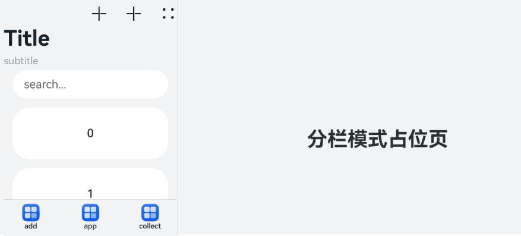

# Navigation2

- 说明：这是 Navigation 分栏显示的示例代码
- 链接：https://developer.huawei.com/consumer/cn/doc/harmonyos-references/ts-basic-components-navigation#%E7%A4%BA%E4%BE%8B14%E8%AE%BE%E7%BD%AEnavigation%E5%8F%8C%E6%A0%8F%E6%A8%A1%E5%BC%8F
- 示例图:
  

```TypeScript
import { ComponentContent } from '@kit.ArkUI';

@Builder function PlaceholderPage() {
  Column() {
    Text("分栏模式占位页")
      .fontSize(28)
      .fontWeight(700)
      .margin({ top: 200 })
  }.width("100%")
  .height("100%")
}

@Entry
@Component
struct NavigationExample {
  @State minNavBarWidth: Dimension | undefined = undefined;
  @State maxNavBarWidth: Dimension | undefined = undefined;
  @State minContentWidth: Dimension|undefined = undefined;
  private arr: number[] = [0, 1, 2, 3, 4, 5, 6, 7, 8, 9];
  @State currentIndex: number = 0;
  placeholder = new ComponentContent(this.getUIContext(), wrapBuilder(PlaceholderPage))

  @Builder
  NavigationTitle() {
    Column() {
      Text('Title')
        .fontColor('#182431')
        .fontSize(30)
        .lineHeight(41)
        .fontWeight(700)
      Text('subtitle')
        .fontColor('#182431')
        .fontSize(14)
        .lineHeight(19)
        .opacity(0.4)
        .margin({ top: 2, bottom: 20 })
    }.alignItems(HorizontalAlign.Start)
  }

  @Builder
  NavigationMenus() {
    Row() {
      // $r('sys.media.ohos_ic_public_add')需要替换为开发者所需的资源文件
      Image($r('sys.media.ohos_ic_public_add'))
        .width(24)
        .height(24)
      // $r('sys.media.ohos_ic_public_add')需要替换为开发者所需的资源文件
      Image($r('sys.media.ohos_ic_public_add'))
        .width(24)
        .height(24)
        .margin({ left: 24 })
      // $r('sys.media.ohos_ic_public_more')需要替换为开发者所需的资源文件
      Image($r('sys.media.ohos_ic_public_more'))
        .width(24)
        .height(24)
        .margin({ left: 24 })
    }.margin({ top: 30 })
  }

  build() {
    Column() {
      Navigation() {
        TextInput({ placeholder: 'search...' })
          .width('90%')
          .height(40)
          .backgroundColor('#FFFFFF')
          .margin({ top: 8 })

        List({ space: 12, initialIndex: 0 }) {
          ForEach(this.arr, (item: number) => {
            ListItem() {
              Text('' + item)
                .width('90%')
                .height(72)
                .backgroundColor('#FFFFFF')
                .borderRadius(24)
                .fontSize(16)
                .fontWeight(500)
                .textAlign(TextAlign.Center)
            }
          }, (item: number) => item.toString())
        }
        .height(324)
        .width('100%')
        .margin({ top: 12, left: '10%' })
      }
      .title(this.NavigationTitle)
      .padding({ left: 12 })
      .menus(this.NavigationMenus)
      .titleMode(NavigationTitleMode.Full)
      .toolbarConfiguration([
        {
          // $r("app.string.navigation_toolbar_add")和$r("app.media.startIcon")需要替换为开发者所需的图像资源文件
          value: $r("app.string.navigation_toolbar_add"),
          icon: $r("app.media.startIcon")
        },
        {
          // $r("app.string.navigation_toolbar_app")和$r("app.media.startIcon")需要替换为开发者所需的图像资源文件
          value: $r("app.string.navigation_toolbar_app"),
          icon: $r("app.media.startIcon")
        },
        {
          // $r("app.string.navigation_toolbar_collect")和$r("app.media.startIcon")需要替换为开发者所需的图像资源文件
          value: $r("app.string.navigation_toolbar_collect"),
          icon: $r("app.media.startIcon")
        }
      ])
      .mode(NavigationMode.Split) // 设置Navigation模式为Split
      .navBarWidthRange([this.minNavBarWidth, this.maxNavBarWidth]) // 设置导航页宽度范围：[最小宽度, 最大宽度]
      .minContentWidth(this.minContentWidth)
      .hideTitleBar(false)
      .hideToolBar(false)
      .onTitleModeChange((titleModel: NavigationTitleMode) => {
        console.info('titleMode' + titleModel)
      })
      .splitPlaceholder(this.placeholder)
    }.width('100%').height('100%').backgroundColor('#F1F3F5')
  }
}
```
