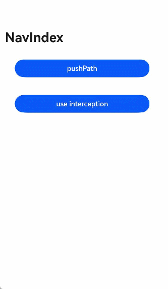

# Navigation3

- 说明：该示例主要演示NavPathStack中方法的使用及路由拦截。
- 链接：https://developer.huawei.com/consumer/cn/doc/harmonyos-references/ts-basic-components-navigation#%E7%A4%BA%E4%BE%8B2%E4%BD%BF%E7%94%A8%E5%AF%BC%E8%88%AA%E6%8E%A7%E5%88%B6%E5%99%A8%E6%96%B9%E6%B3%95
- 示例图:
  

```TypeScript
// Index.ets
@Entry
@Component
struct NavigationExample {
  pageInfos: NavPathStack = new NavPathStack();
  isUseInterception: boolean = false;

  registerInterception() {
    this.pageInfos.setInterception({
      // 页面跳转前拦截，允许操作栈，在当前跳转中生效。
      willShow: (from: NavDestinationContext | "navBar", to: NavDestinationContext | "navBar",
        operation: NavigationOperation, animated: boolean) => {
        if (!this.isUseInterception) {
          return;
        }
        if (typeof to === "string") {
          console.info("target page is navigation home");
          return;
        }
        // 重定向目标页面，更改为pageTwo页面到pageOne页面。
        let target: NavDestinationContext = to as NavDestinationContext;
        if (target.pathInfo.name === 'pageTwo') {
          target.pathStack.pop();
          target.pathStack.pushPathByName('pageOne', null);
        }
      },
      // 页面跳转后回调，在该回调中操作栈在下一次跳转中刷新。
      didShow: (from: NavDestinationContext | "navBar", to: NavDestinationContext | "navBar",
        operation: NavigationOperation, isAnimated: boolean) => {
        if (!this.isUseInterception) {
          return;
        }
        if (typeof from === "string") {
          console.info("current transition is from navigation home");
        } else {
          console.info(`current transition is from  ${(from as NavDestinationContext).pathInfo.name}`);
        }
        if (typeof to === "string") {
          console.info("current transition to is navBar");
        } else {
          console.info(`current transition is to ${(to as NavDestinationContext).pathInfo.name}`);
        }
      },
      // Navigation单双栏显示状态发生变更时触发该回调。
      modeChange: (mode: NavigationMode) => {
        if (!this.isUseInterception) {
          return;
        }
        console.info(`current navigation mode is ${mode}`);
      }
    })
  }

  build() {
    Navigation(this.pageInfos) {
      Column() {
        Button('pushPath', { stateEffect: true, type: ButtonType.Capsule })
          .width('80%')
          .height(40)
          .margin(20)
          .onClick(() => {
            this.pageInfos.pushPath({ name: 'pageOne' }); // 将name指定的NavDestination页面信息入栈
          })
        Button('use interception', { stateEffect: true, type: ButtonType.Capsule })
          .width('80%')
          .height(40)
          .margin(20)
          .onClick(() => {
            this.isUseInterception = !this.isUseInterception;
            if (this.isUseInterception) {
              this.registerInterception();
            } else {
              this.pageInfos.setInterception(undefined);
            }
          })
      }
    }.title('NavIndex')
  }
}
```

```TypeScript
// PageOne.ets
class TmpClass {
  count: number = 10;
}

@Builder
export function PageOneBuilder(name: string, param: Object) {
  PageOne()
}

@Component
export struct PageOne {
  pageInfos: NavPathStack = new NavPathStack();

  build() {
    NavDestination() {
      Column() {
        Button('pushPathByName', { stateEffect: true, type: ButtonType.Capsule })
          .width('80%')
          .height(40)
          .margin(20)
          .onClick(() => {
            let tmp = new TmpClass();
            this.pageInfos.pushPathByName('pageTwo', tmp); // 将name指定的NavDestination页面信息入栈，传递的数据为param
          })
        Button('singletonLaunchMode', { stateEffect: true, type: ButtonType.Capsule })
          .width('80%')
          .height(40)
          .margin(20)
          .onClick(() => {
            this.pageInfos.pushPath({ name: 'pageOne' },
              { launchMode: LaunchMode.MOVE_TO_TOP_SINGLETON }); // 从栈底向栈顶查找，如果指定的名称已经存在，则将对应的NavDestination页面移到栈顶
          })
        Button('popToname', { stateEffect: true, type: ButtonType.Capsule })
          .width('80%')
          .height(40)
          .margin(20)
          .onClick(() => {
            this.pageInfos.popToName('pageTwo'); // 回退路由栈到第一个名为name的NavDestination页面
            console.info(`popToName ${JSON.stringify(this.pageInfos)}，` +
              `返回值 ${JSON.stringify(this.pageInfos.popToName('pageTwo'))}`);
          })
        Button('popToIndex', { stateEffect: true, type: ButtonType.Capsule })
          .width('80%')
          .height(40)
          .margin(20)
          .onClick(() => {
            this.pageInfos.popToIndex(1); // 回退路由栈到index指定的NavDestination页面
            console.info(`popToIndex ${JSON.stringify(this.pageInfos)}`);
          })
        Button('moveToTop', { stateEffect: true, type: ButtonType.Capsule })
          .width('80%')
          .height(40)
          .margin(20)
          .onClick(() => {
            this.pageInfos.moveToTop('pageTwo'); // 将第一个名为name的NavDestination页面移到栈顶
            console.info(`moveToTop ${JSON.stringify(this.pageInfos)}，` +
              `返回值 ${JSON.stringify(this.pageInfos.popToName('pageTwo'))}`);
          })
        Button('moveIndexToTop', { stateEffect: true, type: ButtonType.Capsule })
          .width('80%')
          .height(40)
          .margin(20)
          .onClick(() => {
            this.pageInfos.moveIndexToTop(1); // 将index指定的NavDestination页面移到栈顶
            console.info(`moveIndexToTop ${JSON.stringify(this.pageInfos)}`);
          })
        Button('clear', { stateEffect: true, type: ButtonType.Capsule })
          .width('80%')
          .height(40)
          .margin(20)
          .onClick(() => {
            this.pageInfos.clear(); // 清除栈中所有页面
          })
        Button('get', { stateEffect: true, type: ButtonType.Capsule })
          .width('80%')
          .height(40)
          .margin(20)
          .onClick(() => {
            console.info('-------------------');
            console.info(`获取栈中所有NavDestination页面的名称 ${JSON.stringify(this.pageInfos.getAllPathName())}`);
            console.info(`获取index指定的NavDestination页面的参数信息 ${JSON.stringify(this.pageInfos.getParamByIndex(1))}`);
            console.info(`获取全部名为name的NavDestination页面的参数信息 ${JSON.stringify(this.pageInfos.getParamByName('pageTwo'))}`);
            console.info(`获取全部名为name的NavDestination页面的位置索引 ${JSON.stringify(this.pageInfos.getIndexByName('pageOne'))}`);
            console.info(`获取栈大小 ${JSON.stringify(this.pageInfos.size())}`);
          })
      }.width('100%').height('100%')
    }.title('pageOne')
    .onBackPressed(() => {
      const popDestinationInfo = this.pageInfos.pop(); // 弹出路由栈栈顶元素
      console.info(`pop 返回值 ${JSON.stringify(popDestinationInfo)}`);
      return true;
    }).onReady((context: NavDestinationContext) => {
      this.pageInfos = context.pathStack;
    })
  }
}
```

```TypeScript
// PageTwo.ets
@Builder
export function PageTwoBuilder(name: string, param: Object) {
  PageTwo()
}

@Component
export struct PageTwo {
  pathStack: NavPathStack = new NavPathStack();
  private menuItems: Array<NavigationMenuItem> = [
    {
      // 'resources/base/media/undo.svg'需要替换为开发者所需的资源文件
      value: "1",
      icon: 'resources/base/media/undo.svg',
    },
    {
      // 'resources/base/media/redo.svg'需要替换为开发者所需的资源文件
      value: "2",
      icon: 'resources/base/media/redo.svg',
      isEnabled: false,
    },
    {
      // 'resources/base/media/ic_public_ok.svg'需要替换为开发者所需的资源文件
      value: "3",
      icon: 'resources/base/media/ic_public_ok.svg',
      isEnabled: true,
    }
  ];

  build() {
    NavDestination() {
      Column() {
        Button('pushPathByName', { stateEffect: true, type: ButtonType.Capsule })
          .width('80%')
          .height(40)
          .margin(20)
          .onClick(() => {
            this.pathStack.pushPathByName('pageOne', null);
          })
      }.width('100%').height('100%')
    }.title('pageTwo')
    .menus(this.menuItems)
    .onBackPressed(() => {
      this.pathStack.pop();
      return true;
    })
    .onReady((context: NavDestinationContext) => {
      this.pathStack = context.pathStack;
      console.info(`current page config info is ${JSON.stringify(context.getConfigInRouteMap())}`);
    })
  }
}
```

在src/main目录下的module.json5配置文件中的module字段里配置"routerMap": "$profile:router_map"，并在src/main/resources/base/profile目录下新增router_map.json。router_map.json示例如下。

```json
{
  "routerMap": [
    {
      "name": "pageOne",
      "pageSourceFile": "src/main/ets/pages/PageOne.ets",
      "buildFunction": "PageOneBuilder",
      "data": {
        "description": "this is pageOne"
      }
    },
    {
      "name": "pageTwo",
      "pageSourceFile": "src/main/ets/pages/PageTwo.ets",
      "buildFunction": "PageTwoBuilder"
    }
  ]
}
```
